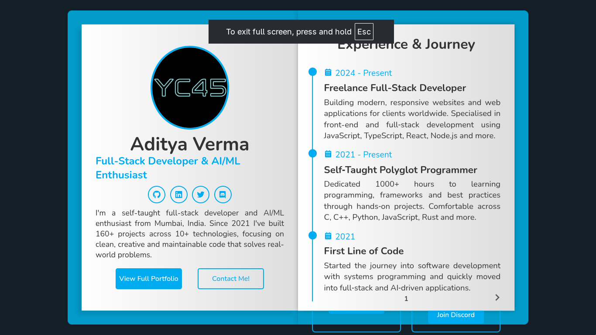
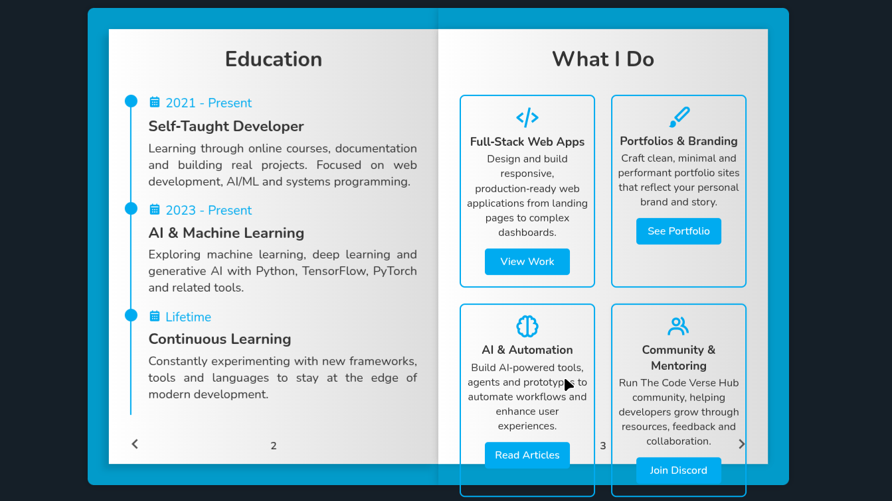
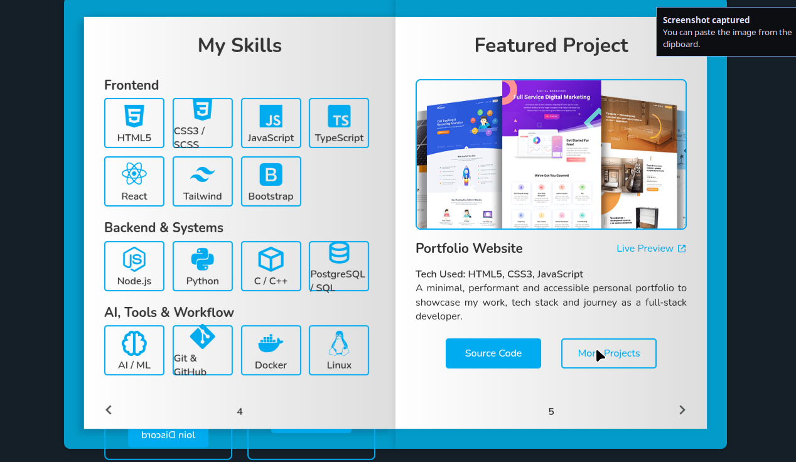
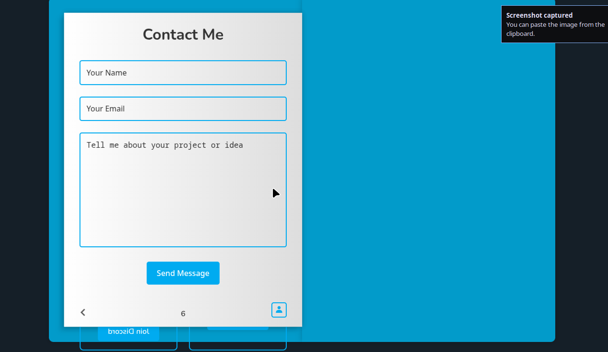

# Aditya Verma – 3D Portfolio Book

A 3D, book-style version of my personal portfolio, built with HTML, CSS, and a small amount of vanilla JavaScript. Each "page" showcases a different part of my profile: introduction, experience, services, skills, featured project, and a contact form.

## Live Portfolio

This project mirrors content from my main portfolio:

- Main site: https://aditya-verma.me (not this one)
- GitHub: https://github.com/youngcoder45

## Features

- Animated 3D book layout with opening cover effect.
- Profile page with photo, social links, and short bio.
- Timeline-style sections for experience and education/journey.
- Services page describing what I do (full‑stack, AI, portfolio sites, community).
- Skills page grouped by frontend, backend/systems, and AI/tools.
- Featured project page highlighting my portfolio website with links to live demo and source.
- Contact page with a simple mailto form wired to `contact@aditya-verma.me`.

## Tech Stack

- **HTML5** – Markup and semantic structure of the pages.
- **CSS3** – Layout, 3D transforms, animations, and responsive styling.
- **Boxicons** – Icon set for social links and tech icons.
- **Vanilla JavaScript** – Page-turn interactions and book-opening animation.

## Getting Started

1. Open `index.html` in a modern browser (Chrome, Firefox, Edge).
2. Make sure you have an internet connection so Boxicons and any remote assets can load.
3. Click the right/left arrows to flip through the pages.
4. Use the **Contact Me** button on the cover page to jump to the contact page.

## Project Structure

- `index.html` – 3D book markup and portfolio content.
- `style.css` – All styling, layout, and animations for the book.
- `script.js` – Logic for page turns, opening animation, and navigation.

## Screenshots

Below are some preview shots of the 3D portfolio book:

## Customization

- Update text content (name, bio, services, skills, project) directly in `index.html`.
- Swap the profile image URL with your own by editing the `` tag on the profile page.
- Adjust colors, fonts, and 3D behavior via CSS variables and rules in `style.css`.
- Extend the JavaScript interactions in `script.js` if you want more advanced navigation.

## License

This project is intended as a personal portfolio and learning resource. If you fork it, please replace my personal information, images, and links with your own.
